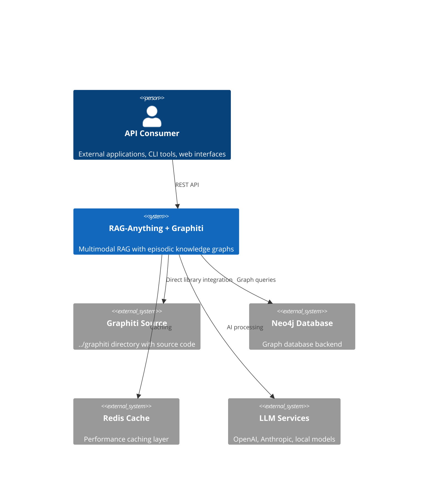
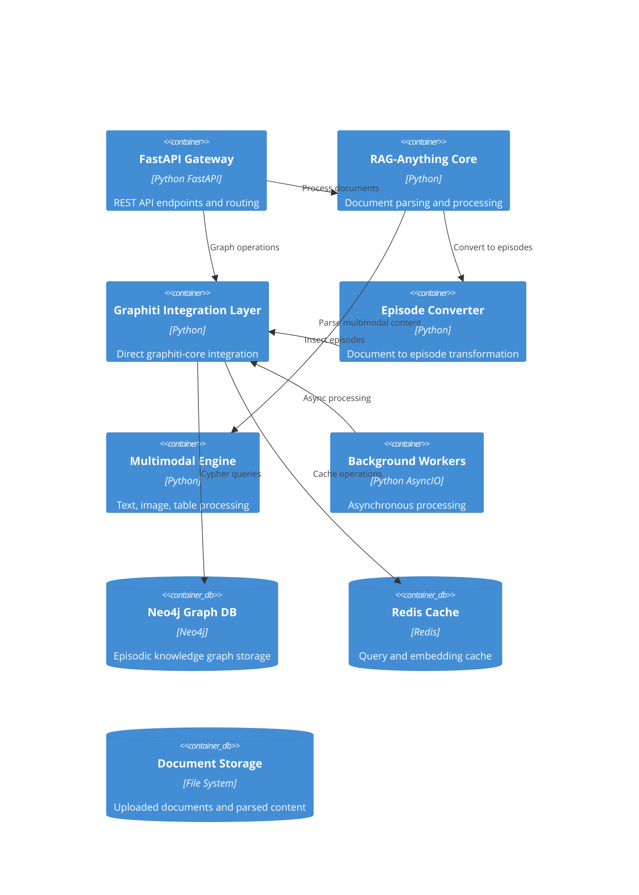
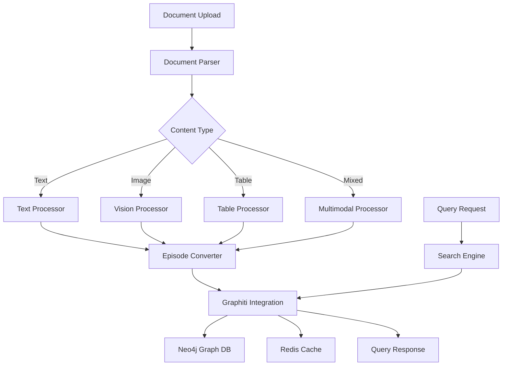

# RAG-Anything + Graphiti-Core Integration Architecture

## Executive Summary

This architecture defines the direct integration of RAG-Anything's multimodal document processing capabilities with graphiti-core library to create a high-performance episodic knowledge graph system. The integration maximizes performance through direct library usage while providing a clean REST API interface for external consumers.

## Architecture Overview

### System Context


### Container Diagram


## Technology Stack

### Core Dependencies
- **Python**: 3.10+ (matching graphiti-core requirements)
- **FastAPI**: 0.104+ (async REST API framework)
- **Graphiti-Core**: 0.19.0+ (built from source in ../graphiti)
- **Neo4j**: 5.26.0+ (primary graph database)
- **Redis**: 7.0+ (caching and session management)

### Document Processing
- **MinerU**: PDF, image, and table extraction
- **Docling**: Alternative document parser
- **Pillow**: Image processing
- **OpenCV**: Computer vision tasks
- **Pandas**: Table data manipulation

### AI/ML Services
- **OpenAI**: GPT-4, GPT-4V, text-embedding-3-large
- **Anthropic**: Claude-3 models (optional)
- **Sentence Transformers**: Local embedding models (optional)
- **OpenAI Reranker**: Cross-encoder for search

## Component Design

### Graphiti Integration Layer
**Purpose**: Direct integration with graphiti-core library for episodic knowledge graph operations
**Technology**: Python direct library import
**Interfaces**: 
- Input: Parsed document content, metadata
- Output: Episode insertion results, query responses
**Dependencies**: Neo4j driver, LLM clients, embedding models

**Key Features**:
- Direct library integration for maximum performance
- Asynchronous batch processing
- Connection pooling and caching
- Error handling with fallback to LightRAG

### Episode Conversion Pipeline
**Purpose**: Transform multimodal documents into Graphiti-compatible episodes
**Technology**: Python with custom transformation logic
**Interfaces**:
- Input: Parsed document structure (text, images, tables, metadata)
- Output: List of Episode objects for Graphiti
**Dependencies**: Document parsers, content extractors

**Conversion Strategy**:
- Section-based episodes for structured documents
- Page-based episodes for PDFs
- Multimodal episodes for rich content
- Hierarchical relationships between episodes

### Multimodal Processing Engine
**Purpose**: Extract and process text, images, tables, and equations from documents
**Technology**: MinerU/Docling + custom processors
**Interfaces**:
- Input: Raw document files (PDF, DOCX, images)
- Output: Structured multimodal content
**Dependencies**: Vision models, OCR engines, table extractors

### Background Processing System
**Purpose**: Handle large document processing asynchronously
**Technology**: Python AsyncIO with worker queues
**Interfaces**:
- Input: Processing jobs via Redis queue
- Output: Processing status and results
**Dependencies**: Redis, Celery (optional), progress tracking

## Data Architecture

### Data Flow


### Episode Data Model
```python
class Episode:
    """Graphiti-compatible episode structure"""
    name: str                    # Unique episode identifier
    content: str                # Main text content
    source_description: str     # Content source metadata
    group_id: str               # Grouping identifier
    reference_time: datetime    # Temporal reference
    
    # RAG-Anything extensions
    multimodal_content: Dict[str, Any]  # Images, tables, equations
    document_metadata: Dict[str, Any]   # File info, processing details
    section_hierarchy: List[str]        # Document structure
    extraction_confidence: float       # Processing quality score
```

### Knowledge Graph Schema
```cypher
-- Core Graphiti nodes
CREATE (episode:Episode {
    name: string,
    content: string,
    group_id: string,
    reference_time: datetime,
    
    -- RAG-Anything extensions
    document_id: string,
    section_path: string,
    content_type: string,
    extraction_confidence: float
})

-- Multimodal content nodes
CREATE (image:ImageContent {
    episode_id: string,
    image_path: string,
    description: string,
    extracted_text: string,
    confidence_score: float
})

CREATE (table:TableContent {
    episode_id: string,
    table_data: string,  -- JSON serialized
    column_headers: [string],
    row_count: integer,
    extraction_method: string
})

-- Relationships
CREATE (episode)-[:CONTAINS_IMAGE]->(image)
CREATE (episode)-[:CONTAINS_TABLE]->(table)
CREATE (episode)-[:FOLLOWS]->(next_episode)
CREATE (episode)-[:SECTION_OF]->(parent_episode)
```

## API Architecture

### Authentication & Authorization
- **API Key Authentication**: Simple key-based access control
- **JWT Tokens**: For user sessions and permissions
- **Rate Limiting**: Per-key request throttling
- **Input Validation**: Comprehensive request sanitization

### Security Measures
- [x] HTTPS mandatory
- [x] Input validation and sanitization
- [x] File upload restrictions
- [x] Query injection prevention
- [x] API rate limiting
- [x] Secrets management via environment variables
- [x] CORS configuration
- [x] Request size limits

## Scalability Strategy

### Horizontal Scaling
- **Load Balancing**: NGINX with multiple FastAPI instances
- **Session Management**: Redis-based session storage
- **Database Replication**: Neo4j Enterprise clustering
- **Cache Distribution**: Redis cluster for cache scaling

### Performance Optimization
- **Connection Pooling**: Persistent database connections
- **Query Caching**: Redis-based query result caching
- **Embedding Caching**: Cached embeddings for repeated content
- **Batch Processing**: Bulk operations for large documents
- **Async Processing**: Non-blocking I/O for all operations

### Caching Strategy
```python
# Multi-level caching architecture
class CacheManager:
    """Manages multiple cache layers"""
    
    # Level 1: In-memory process cache
    process_cache: Dict[str, Any] = {}
    
    # Level 2: Redis shared cache
    redis_cache: Redis = Redis()
    
    # Level 3: Persistent disk cache
    disk_cache: DiskCache = DiskCache('./cache')
    
    # Cached entities
    - Query results (1 hour TTL)
    - Document embeddings (24 hour TTL)  
    - Episode extractions (24 hour TTL)
    - Graph search results (30 min TTL)
    - Authentication tokens (session TTL)
```

## Build System Architecture

### Graphiti-Core Integration Strategy
```bash
# Direct source integration approach
├── pyproject.toml                    # Main project dependencies
├── requirements/
│   ├── base.txt                     # Core dependencies
│   ├── graphiti.txt                 # Graphiti-specific deps
│   └── dev.txt                      # Development dependencies
├── scripts/
│   ├── build-graphiti.sh           # Build graphiti from source
│   ├── install-deps.sh             # Install all dependencies
│   └── verify-integration.py       # Test graphiti integration
└── src/
    ├── graphiti_source/            # Git submodule or direct copy
    └── raganything/
        └── backends/
            └── graphiti_direct/    # Direct integration module
```

### Build Process
1. **Source Acquisition**: Git submodule or automated clone of ../graphiti
2. **Dependency Installation**: Install graphiti-core dependencies
3. **Direct Integration**: Import graphiti modules directly
4. **Validation**: Test integration functionality
5. **Package Building**: Create distributable package

### Environment Configuration
```yaml
# docker-compose.yml for complete stack
services:
  raganything-api:
    build:
      context: .
      dockerfile: Dockerfile
    environment:
      - GRAPHITI_SOURCE_PATH=/app/graphiti_source
      - NEO4J_URL=bolt://neo4j:7687
      - REDIS_URL=redis://redis:6379
    depends_on:
      - neo4j
      - redis
      
  neo4j:
    image: neo4j:5.26-enterprise
    environment:
      NEO4J_AUTH: neo4j/password
      NEO4J_PLUGINS: '["apoc", "graph-data-science"]'
      
  redis:
    image: redis:7-alpine
    command: redis-server --maxmemory 256mb --maxmemory-policy allkeys-lru
```

## Deployment Architecture

### Container Strategy
```dockerfile
# Multi-stage Dockerfile
FROM python:3.10-slim as graphiti-builder
# Build graphiti-core from source
WORKDIR /build
COPY graphiti_source/ ./graphiti/
RUN cd graphiti && pip install -e .

FROM python:3.10-slim as app
# Copy built graphiti and install RAG-Anything
COPY --from=graphiti-builder /usr/local/lib/python3.10/site-packages/ /usr/local/lib/python3.10/site-packages/
COPY . /app
WORKDIR /app
RUN pip install -e .

EXPOSE 8000
CMD ["uvicorn", "python_api.main:app", "--host", "0.0.0.0", "--port", "8000"]
```

### Environment Configurations

#### Development
- Local Neo4j instance
- Local Redis for caching
- File-based document storage
- Debug logging enabled

#### Staging  
- Managed Neo4j cluster
- Redis cluster
- S3-compatible object storage
- Performance monitoring

#### Production
- Neo4j Enterprise cluster
- Redis Enterprise
- CDN for static assets
- Full observability stack

## Migration Architecture

### LightRAG to Graphiti Migration
```python
class MigrationManager:
    """Handles migration from LightRAG to Graphiti"""
    
    async def migrate_knowledge_graph(
        self, 
        lightrag_path: str, 
        graphiti_config: Dict
    ) -> MigrationResult:
        """
        Migrate existing LightRAG graph to Graphiti format
        
        Steps:
        1. Extract entities and relationships from LightRAG
        2. Convert to episode format
        3. Import into Graphiti with proper temporal references
        4. Validate migration completeness
        5. Update system configuration
        """
        pass
```

### Backward Compatibility Layer
- REST API compatibility with existing LightRAG endpoints
- Automatic format conversion for legacy queries
- Gradual migration support with dual-backend operation
- Configuration flags for progressive rollout

## Monitoring & Observability

### Metrics Collection
```python
class MetricsCollector:
    """Performance and business metrics"""
    
    # Performance metrics
    - API response times
    - Document processing duration
    - Graph query performance
    - Cache hit/miss ratios
    - Background job processing times
    
    # Business metrics  
    - Documents processed per hour
    - Episodes created per document
    - Query success rates
    - User engagement metrics
    - Storage utilization
```

### Health Monitoring
```python
@app.get("/health")
async def health_check():
    return {
        "status": "healthy",
        "components": {
            "graphiti": await graphiti_health_check(),
            "neo4j": await neo4j_health_check(),
            "redis": await redis_health_check(),
            "parsers": await parser_health_check()
        },
        "version": get_version(),
        "timestamp": datetime.utcnow().isoformat()
    }
```

### Logging Strategy
- **Structured Logging**: JSON format for all log entries
- **Log Levels**: DEBUG, INFO, WARN, ERROR, CRITICAL
- **Log Aggregation**: Centralized logging with ELK stack
- **Retention Policies**: 30 days for debug, 90 days for errors
- **Performance Logging**: Query timing and resource usage

## Error Handling & Recovery

### Graceful Degradation
1. **Graphiti Unavailable**: Fallback to LightRAG backend
2. **Neo4j Connection Issues**: Use cached results where possible
3. **Parser Failures**: Try alternative parsers
4. **LLM Service Errors**: Queue for retry or use alternative models
5. **Memory Pressure**: Implement backpressure and request throttling

### Recovery Strategies
```python
class RecoveryManager:
    """Handles system recovery scenarios"""
    
    async def handle_graphiti_failure(self):
        """Switch to LightRAG backend automatically"""
        
    async def handle_neo4j_outage(self):
        """Use read replicas or cached data"""
        
    async def handle_parser_errors(self):
        """Try fallback parsers or manual processing"""
        
    async def handle_memory_pressure(self):
        """Implement backpressure and cleanup"""
```

## Architectural Decisions (ADRs)

### ADR-001: Direct Graphiti-Core Integration
**Status**: Accepted
**Context**: Need maximum performance and lowest latency for graph operations
**Decision**: Integrate graphiti-core as direct Python library import rather than REST API
**Consequences**: 
- Pros: Maximum performance, no network overhead, direct access to all features
- Cons: Tighter coupling, version management complexity, build process complexity
**Alternatives Considered**: REST API integration, gRPC service, message queue integration

### ADR-002: Episode-Based Document Conversion
**Status**: Accepted
**Context**: Graphiti works with episodes, RAG-Anything processes complex documents
**Decision**: Convert documents into logical episodes based on structure and content
**Consequences**:
- Pros: Natural fit for Graphiti's temporal model, preserves document structure
- Cons: Additional processing step, complexity in episode boundary detection
**Alternatives Considered**: Direct text insertion, single episode per document

### ADR-003: Multi-Backend Support with Fallback
**Status**: Accepted
**Context**: Need reliability and migration path from LightRAG
**Decision**: Support both Graphiti and LightRAG backends with automatic fallback
**Consequences**:
- Pros: High availability, smooth migration path, user choice
- Cons: Increased complexity, dual maintenance burden
**Alternatives Considered**: Graphiti-only, migration-then-switch approach

### ADR-004: Redis for Multi-Level Caching
**Status**: Accepted
**Context**: Need high-performance caching for queries, embeddings, and sessions
**Decision**: Use Redis as primary cache with multiple cache levels
**Consequences**:
- Pros: High performance, persistence options, clustering support
- Cons: Additional infrastructure dependency, memory usage
**Alternatives Considered**: In-memory only, database-based caching, disk-based caching

This architecture provides a robust foundation for integrating RAG-Anything with Graphiti-Core while maintaining high performance, scalability, and reliability. The direct library integration approach maximizes performance while the REST API provides a clean interface for external consumers.