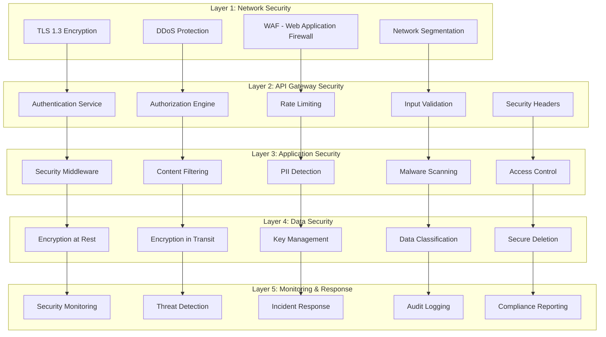

# Security Architecture - RAG-Anything Enterprise Security Framework

## Executive Summary

This document defines the comprehensive security architecture for the RAG-Anything + Graphiti integration, designed to meet enterprise-grade security requirements while maintaining performance and usability. The architecture implements a multi-layered security approach with defense-in-depth principles, comprehensive audit logging, and real-time threat detection.

**Security Objectives:**
- **Confidentiality**: Protect sensitive data and prevent unauthorized access
- **Integrity**: Ensure data accuracy and prevent tampering
- **Availability**: Maintain service availability under attack
- **Accountability**: Provide complete audit trails for all operations
- **Compliance**: Meet regulatory requirements (GDPR, CCPA, SOX, HIPAA)

## Security Architecture Overview

### Security Layers Diagram



## Authentication & Authorization Architecture

### Multi-Factor Authentication System

```python
from typing import Optional, Dict, Any, List
from dataclasses import dataclass
from datetime import datetime, timedelta
import hashlib
import secrets
import jwt
from enum import Enum

class AuthMethod(Enum):
    PASSWORD = "password"
    TOTP = "totp"
    SMS = "sms"
    HARDWARE_TOKEN = "hardware_token"
    BIOMETRIC = "biometric"

@dataclass
class AuthenticationContext:
    """Complete authentication context"""
    user_id: str
    session_id: str
    authentication_methods: List[AuthMethod]
    authentication_timestamp: datetime
    ip_address: str
    user_agent: str
    device_fingerprint: str
    risk_score: float
    requires_step_up: bool = False

class SecureAuthenticationService:
    """Enterprise authentication service with MFA support"""
    
    def __init__(self, config: Dict[str, Any]):
        self.config = config
        self.failed_attempts: Dict[str, List[datetime]] = {}
        self.session_store = RedisSessionStore()
        self.audit_logger = AuditLogger()
        self.risk_analyzer = RiskAnalyzer()
        
        # Security settings
        self.max_failed_attempts = config.get('max_failed_attempts', 5)
        self.lockout_duration = timedelta(minutes=config.get('lockout_minutes', 30))
        self.session_timeout = timedelta(hours=config.get('session_hours', 8))
        self.jwt_secret = config.get('jwt_secret')
        self.require_mfa = config.get('require_mfa', True)
    
    async def authenticate_user(self, credentials: Dict[str, Any], 
                               request_context: RequestContext) -> AuthenticationResult:
        """Comprehensive user authentication with security controls"""
        
        username = credentials.get('username')
        if not username:
            raise AuthenticationError("Username required")
        
        try:
            # 1. Check account lockout
            if await self._is_account_locked(username):
                await self._log_authentication_attempt(username, False, "account_locked", request_context)
                raise AuthenticationError("Account temporarily locked due to failed attempts")
            
            # 2. Risk assessment
            risk_score = await self.risk_analyzer.assess_request_risk(username, request_context)
            
            # 3. Primary authentication
            user = await self._validate_primary_credentials(credentials)
            if not user:
                await self._handle_failed_attempt(username, request_context)
                raise AuthenticationError("Invalid credentials")
            
            # 4. Check if MFA is required
            mfa_required = self.require_mfa or risk_score > 0.5 or user.requires_mfa
            
            if mfa_required and not credentials.get('mfa_token'):
                # Initiate MFA challenge
                mfa_challenge = await self._initiate_mfa_challenge(user, request_context)
                return AuthenticationResult(
                    status='mfa_required',
                    user_id=user.user_id,
                    mfa_challenge=mfa_challenge,
                    temp_token=self._generate_temp_token(user.user_id)
                )
            
            # 5. Validate MFA if provided
            if mfa_required:
                if not await self._validate_mfa_token(user, credentials.get('mfa_token')):
                    await self._handle_failed_attempt(username, request_context)
                    raise AuthenticationError("Invalid MFA token")
            
            # 6. Create secure session
            auth_context = await self._create_authentication_context(
                user, request_context, risk_score, mfa_required
            )
            
            # 7. Generate secure tokens
            access_token = await self._generate_access_token(user, auth_context)
            refresh_token = await self._generate_refresh_token(user, auth_context)
            
            # 8. Store session securely
            await self.session_store.create_session(auth_context.session_id, {
                'user_id': user.user_id,
                'auth_methods': [m.value for m in auth_context.authentication_methods],
                'created_at': auth_context.authentication_timestamp.isoformat(),
                'ip_address': auth_context.ip_address,
                'risk_score': auth_context.risk_score
            }, self.session_timeout)
            
            # 9. Clear failed attempts
            await self._clear_failed_attempts(username)
            
            # 10. Log successful authentication
            await self._log_authentication_attempt(username, True, "success", request_context)
            
            return AuthenticationResult(
                status='success',
                user_id=user.user_id,
                access_token=access_token,
                refresh_token=refresh_token,
                expires_in=3600,  # 1 hour
                session_id=auth_context.session_id,
                user_info=self._sanitize_user_info(user),
                requires_password_change=user.password_expired
            )
            
        except Exception as e:
            await self.audit_logger.log_security_event(
                'authentication_error',
                {
                    'username': username,
                    'error': str(e),
                    'ip_address': request_context.ip_address,
                    'timestamp': datetime.utcnow()
                }
            )
            raise
    
    async def _validate_primary_credentials(self, credentials: Dict[str, Any]) -> Optional['User']:
        """Validate username and password with secure hashing"""
        username = credentials.get('username')
        password = credentials.get('password')
        
        if not username or not password:
            return None
        
        # Retrieve user from secure storage
        user = await self.user_store.get_user_by_username(username)
        if not user:
            # Prevent timing attacks by still hashing
            hashlib.pbkdf2_hmac('sha256', b'dummy', b'salt', 100000)
            return None
        
        # Verify password with constant-time comparison
        if not self._verify_password(password, user.password_hash):
            return None
        
        # Check if account is active
        if not user.is_active:
            return None
        
        # Check password expiration
        if user.password_expires_at and user.password_expires_at < datetime.utcnow():
            user.password_expired = True
        
        return user
    
    async def _initiate_mfa_challenge(self, user: 'User', 
                                     request_context: RequestContext) -> Dict[str, Any]:
        """Initiate multi-factor authentication challenge"""
        available_methods = await self._get_user_mfa_methods(user)
        
        if AuthMethod.TOTP in available_methods:
            return {
                'method': 'totp',
                'message': 'Please enter your TOTP code from your authenticator app'
            }
        elif AuthMethod.SMS in available_methods:
            phone_number = user.phone_number_masked
            await self._send_sms_code(user)
            return {
                'method': 'sms',
                'message': f'SMS code sent to {phone_number}'
            }
        else:
            raise AuthenticationError("No available MFA methods")
    
    async def _create_authentication_context(self, user: 'User', 
                                           request_context: RequestContext,
                                           risk_score: float,
                                           mfa_used: bool) -> AuthenticationContext:
        """Create comprehensive authentication context"""
        auth_methods = [AuthMethod.PASSWORD]
        if mfa_used:
            # Add the MFA method used
            user_mfa_methods = await self._get_user_mfa_methods(user)
            if user_mfa_methods:
                auth_methods.append(user_mfa_methods[0])  # Primary MFA method
        
        return AuthenticationContext(
            user_id=user.user_id,
            session_id=secrets.token_urlsafe(32),
            authentication_methods=auth_methods,
            authentication_timestamp=datetime.utcnow(),
            ip_address=request_context.ip_address,
            user_agent=request_context.user_agent,
            device_fingerprint=await self._generate_device_fingerprint(request_context),
            risk_score=risk_score,
            requires_step_up=risk_score > 0.7  # High-risk operations need step-up auth
        )

class RoleBasedAccessControl:
    """Comprehensive RBAC implementation with fine-grained permissions"""
    
    def __init__(self):
        self.permissions = PermissionRegistry()
        self.roles = RoleRegistry()
        self.policy_engine = PolicyEngine()
    
    async def check_permission(self, user: 'User', permission: str, 
                              resource: Optional[str] = None,
                              context: Optional[Dict[str, Any]] = None) -> bool:
        """Check if user has permission for specific operation"""
        
        # Get user roles
        user_roles = await self._get_user_roles(user.user_id)
        
        # Check direct permissions
        for role in user_roles:
            role_permissions = await self._get_role_permissions(role.role_id)
            
            for perm in role_permissions:
                if await self._permission_matches(perm, permission, resource, context):
                    # Apply policy conditions
                    if await self.policy_engine.evaluate_conditions(
                        perm.conditions, user, resource, context
                    ):
                        await self._log_access_decision(
                            user.user_id, permission, resource, True, f"Granted by role {role.name}"
                        )
                        return True
        
        # Check time-based permissions
        temporal_permissions = await self._get_temporal_permissions(user.user_id)
        for perm in temporal_permissions:
            if (await self._permission_matches(perm, permission, resource, context) and
                await self._is_permission_valid_now(perm)):
                await self._log_access_decision(
                    user.user_id, permission, resource, True, "Granted by temporal permission"
                )
                return True
        
        # Check emergency permissions
        if await self._has_emergency_access(user, permission, context):
            await self._log_access_decision(
                user.user_id, permission, resource, True, "Granted by emergency access"
            )
            return True
        
        await self._log_access_decision(
            user.user_id, permission, resource, False, "No matching permissions found"
        )
        return False
    
    async def _permission_matches(self, permission_obj: 'Permission', 
                                 requested_permission: str,
                                 resource: Optional[str],
                                 context: Optional[Dict[str, Any]]) -> bool:
        """Check if permission object matches the request"""
        
        # Check permission string match (supports wildcards)
        if not self._match_permission_string(permission_obj.permission, requested_permission):
            return False
        
        # Check resource constraints
        if resource and permission_obj.resource_pattern:
            if not self._match_resource_pattern(permission_obj.resource_pattern, resource):
                return False
        
        # Check contextual constraints
        if context and permission_obj.context_constraints:
            if not await self._match_context_constraints(
                permission_obj.context_constraints, context
            ):
                return False
        
        return True

class DataClassificationEngine:
    """Automatic data classification and handling"""
    
    CLASSIFICATION_LEVELS = {
        'public': 0,
        'internal': 1,
        'confidential': 2,
        'restricted': 3,
        'top_secret': 4
    }
    
    def __init__(self):
        self.pii_detector = PIIDetector()
        self.content_analyzer = ContentAnalyzer()
        self.ml_classifier = MLClassifier()
    
    async def classify_document(self, document: 'ProcessedDocument', 
                               user_context: 'SecurityContext') -> DataClassification:
        """Comprehensive document classification"""
        
        classification_result = DataClassification(
            document_id=document.document_id,
            classification_level='public',  # Default
            contains_pii=False,
            pii_types=[],
            sensitive_keywords=[],
            regulatory_tags=[],
            retention_period=None,
            classification_confidence=1.0,
            classified_at=datetime.utcnow(),
            classified_by=user_context.user_id
        )
        
        try:
            # 1. PII Detection
            pii_results = await self.pii_detector.scan_document(document)
            if pii_results.contains_pii:
                classification_result.contains_pii = True
                classification_result.pii_types = pii_results.pii_types
                classification_result.classification_level = 'confidential'
            
            # 2. Content Analysis
            content_analysis = await self.content_analyzer.analyze_content(document)
            
            # Check for sensitive keywords
            sensitive_keywords = await self._detect_sensitive_keywords(document)
            if sensitive_keywords:
                classification_result.sensitive_keywords = sensitive_keywords
                classification_result.classification_level = max(
                    classification_result.classification_level,
                    'confidential',
                    key=lambda x: self.CLASSIFICATION_LEVELS[x]
                )
            
            # 3. Regulatory Classification
            regulatory_analysis = await self._analyze_regulatory_requirements(document)
            classification_result.regulatory_tags = regulatory_analysis.tags
            
            if 'HIPAA' in regulatory_analysis.tags:
                classification_result.classification_level = 'restricted'
                classification_result.retention_period = timedelta(days=2555)  # 7 years
            elif 'GDPR' in regulatory_analysis.tags:
                classification_result.classification_level = 'confidential'
                classification_result.retention_period = timedelta(days=2555)  # 7 years
            elif 'SOX' in regulatory_analysis.tags:
                classification_result.classification_level = 'confidential'
                classification_result.retention_period = timedelta(days=2555)  # 7 years
            
            # 4. ML-based Classification
            ml_prediction = await self.ml_classifier.predict_classification(document)
            if ml_prediction.confidence > 0.8:
                # Use ML prediction if highly confident
                predicted_level = ml_prediction.classification_level
                if (self.CLASSIFICATION_LEVELS[predicted_level] > 
                    self.CLASSIFICATION_LEVELS[classification_result.classification_level]):
                    classification_result.classification_level = predicted_level
                    classification_result.classification_confidence = ml_prediction.confidence
            
            # 5. Context-based Classification
            context_classification = await self._analyze_context_classification(
                document, user_context
            )
            if context_classification:
                classification_result.classification_level = max(
                    classification_result.classification_level,
                    context_classification,
                    key=lambda x: self.CLASSIFICATION_LEVELS[x]
                )
            
        except Exception as e:
            # In case of error, classify as restricted for safety
            classification_result.classification_level = 'restricted'
            classification_result.classification_confidence = 0.0
            await self._log_classification_error(document.document_id, str(e))
        
        return classification_result
```

## Input Validation & Sanitization

### Comprehensive Input Security

```python
from typing import Any, Dict, List, Optional, Union
import re
import html
import json
from urllib.parse import quote, unquote
import magic
import hashlib

class SecurityInputValidator:
    """Comprehensive input validation with security focus"""
    
    INJECTION_PATTERNS = {
        'sql': [
            r'(\bunion\b.*\bselect\b)|(\bselect\b.*\bunion\b)',
            r'\b(drop|delete|insert|update|alter|create)\b.*\b(table|database|schema)\b',
            r'(\bor\b.*=.*|;.*--|\/\*.*\*\/)',
            r'(\bxp_cmdshell\b|\bsp_executesql\b)'
        ],
        'nosql': [
            r'\$where.*function',
            r'\$ne.*\$exists',
            r'this\..*==.*this\.',
            r'function.*return.*true'
        ],
        'ldap': [
            r'\*\)\(.*=',
            r'\)\(\&.*\(',
            r'\)\(\|.*\('
        ],
        'xss': [
            r'<script[^>]*>.*</script>',
            r'javascript:',
            r'vbscript:',
            r'onload.*=',
            r'onerror.*='
        ],
        'command': [
            r'[;&|`$\(\)]',
            r'(cat|ls|pwd|whoami|id)\s',
            r'(rm|chmod|chown)\s.*-[rf]',
            r'curl.*http[s]?://'
        ]
    }
    
    SAFE_FILENAME_PATTERN = r'^[a-zA-Z0-9._-]+$'
    MAX_FILENAME_LENGTH = 255
    
    DANGEROUS_EXTENSIONS = {
        '.exe', '.bat', '.cmd', '.com', '.pif', '.scr', '.vbs', '.js',
        '.jar', '.ps1', '.sh', '.php', '.asp', '.aspx', '.jsp'
    }
    
    def __init__(self):
        self.audit_logger = AuditLogger()
        self.threat_detector = ThreatDetector()
        self.content_filter = ContentFilter()
    
    async def validate_file_upload(self, file_data: bytes, filename: str,
                                  content_type: str, user_context: 'SecurityContext') -> FileValidationResult:
        """Comprehensive file upload validation"""
        
        result = FileValidationResult(
            is_valid=True,
            filename=filename,
            sanitized_filename=None,
            content_type=content_type,
            detected_type=None,
            size=len(file_data),
            security_violations=[],
            warnings=[]
        )
        
        try:
            # 1. Filename validation
            filename_validation = await self._validate_filename(filename)
            if not filename_validation.is_valid:
                result.is_valid = False
                result.security_violations.extend(filename_validation.violations)
            result.sanitized_filename = filename_validation.sanitized_name
            
            # 2. File size validation
            max_size = user_context.max_file_size or (100 * 1024 * 1024)  # 100MB default
            if len(file_data) > max_size:
                result.is_valid = False
                result.security_violations.append(f"File size {len(file_data)} exceeds limit {max_size}")
            
            # 3. Content type validation
            detected_type = magic.from_buffer(file_data, mime=True)
            result.detected_type = detected_type
            
            if detected_type != content_type:
                result.warnings.append(f"Declared type {content_type} differs from detected type {detected_type}")
                # Use detected type for further validation
                content_type = detected_type
            
            # 4. Malware scanning
            malware_scan = await self._scan_for_malware(file_data, filename)
            if malware_scan.threat_detected:
                result.is_valid = False
                result.security_violations.append(f"Malware detected: {malware_scan.threat_name}")
                await self._log_malware_detection(filename, malware_scan.threat_name, user_context)
            
            # 5. Content structure validation
            content_validation = await self._validate_file_content(file_data, content_type)
            if not content_validation.is_valid:
                result.is_valid = False
                result.security_violations.extend(content_validation.violations)
            
            # 6. Embedded content scanning
            embedded_scan = await self._scan_embedded_content(file_data, content_type)
            if embedded_scan.suspicious_content:
                result.warnings.extend(embedded_scan.warnings)
                if embedded_scan.dangerous_content:
                    result.is_valid = False
                    result.security_violations.extend(embedded_scan.violations)
            
        except Exception as e:
            result.is_valid = False
            result.security_violations.append(f"Validation error: {str(e)}")
            await self.audit_logger.log_security_event(
                'file_validation_error',
                {
                    'filename': filename,
                    'error': str(e),
                    'user_id': user_context.user_id
                }
            )
        
        return result
    
    async def validate_query_input(self, query: str, user_context: 'SecurityContext') -> QueryValidationResult:
        """Validate query input for security threats"""
        
        result = QueryValidationResult(
            is_valid=True,
            sanitized_query=query,
            detected_threats=[],
            risk_score=0.0
        )
        
        try:
            # 1. Length validation
            max_length = user_context.max_query_length or 10000
            if len(query) > max_length:
                result.is_valid = False
                result.detected_threats.append(f"Query length {len(query)} exceeds maximum {max_length}")
            
            # 2. Injection pattern detection
            for injection_type, patterns in self.INJECTION_PATTERNS.items():
                for pattern in patterns:
                    if re.search(pattern, query, re.IGNORECASE):
                        result.detected_threats.append(f"Potential {injection_type} injection detected")
                        result.risk_score += 0.3
            
            # 3. Suspicious keyword detection
            suspicious_keywords = await self._detect_suspicious_keywords(query)
            if suspicious_keywords:
                result.detected_threats.extend([f"Suspicious keyword: {kw}" for kw in suspicious_keywords])
                result.risk_score += len(suspicious_keywords) * 0.1
            
            # 4. Character encoding validation
            encoding_validation = await self._validate_character_encoding(query)
            if not encoding_validation.is_valid:
                result.detected_threats.append("Invalid or suspicious character encoding detected")
                result.risk_score += 0.2
            
            # 5. Rate of special characters
            special_char_ratio = len(re.findall(r'[^a-zA-Z0-9\s]', query)) / len(query)
            if special_char_ratio > 0.3:  # More than 30% special characters
                result.detected_threats.append(f"High special character ratio: {special_char_ratio:.2f}")
                result.risk_score += 0.2
            
            # 6. Sanitization
            if result.risk_score > 0:
                result.sanitized_query = await self._sanitize_query(query)
            
            # Determine overall validity
            if result.risk_score > 0.5:
                result.is_valid = False
            
        except Exception as e:
            result.is_valid = False
            result.detected_threats.append(f"Validation error: {str(e)}")
        
        return result
    
    async def _validate_filename(self, filename: str) -> FilenameValidationResult:
        """Validate and sanitize filename"""
        result = FilenameValidationResult(is_valid=True, sanitized_name=filename, violations=[])
        
        # Length check
        if len(filename) > self.MAX_FILENAME_LENGTH:
            result.violations.append(f"Filename too long: {len(filename)} > {self.MAX_FILENAME_LENGTH}")
            result.is_valid = False
        
        # Extension check
        extension = filename.lower().split('.')[-1] if '.' in filename else ''
        if f'.{extension}' in self.DANGEROUS_EXTENSIONS:
            result.violations.append(f"Dangerous file extension: .{extension}")
            result.is_valid = False
        
        # Character validation
        if not re.match(self.SAFE_FILENAME_PATTERN, filename):
            # Sanitize filename
            sanitized = re.sub(r'[^a-zA-Z0-9._-]', '_', filename)
            result.sanitized_name = sanitized[:self.MAX_FILENAME_LENGTH]
            if sanitized != filename:
                result.violations.append("Filename contains unsafe characters, sanitized")
        
        # Path traversal check
        if '..' in filename or filename.startswith('/') or ':' in filename:
            result.violations.append("Path traversal attempt detected")
            result.is_valid = False
        
        return result
```

## Threat Detection & Response

### Real-time Security Monitoring

```python
from typing import Dict, List, Any, Optional
from datetime import datetime, timedelta
import asyncio
from dataclasses import dataclass
from enum import Enum

class ThreatLevel(Enum):
    LOW = "low"
    MEDIUM = "medium"
    HIGH = "high"
    CRITICAL = "critical"

@dataclass
class SecurityThreat:
    """Security threat detection result"""
    threat_id: str
    threat_type: str
    threat_level: ThreatLevel
    detected_at: datetime
    source_ip: str
    user_id: Optional[str]
    description: str
    indicators: List[str]
    confidence_score: float
    automated_response: Optional[str] = None
    investigation_notes: List[str] = None

class ThreatDetectionEngine:
    """Real-time threat detection with ML-based analysis"""
    
    def __init__(self):
        self.anomaly_detector = AnomalyDetector()
        self.behavior_analyzer = BehaviorAnalyzer()
        self.threat_intelligence = ThreatIntelligence()
        self.incident_response = IncidentResponseManager()
        self.alert_manager = AlertManager()
        
        # Detection rules
        self.detection_rules = {
            'brute_force': BruteForceDetectionRule(),
            'data_exfiltration': DataExfiltrationRule(),
            'privilege_escalation': PrivilegeEscalationRule(),
            'malicious_file_upload': MaliciousFileUploadRule(),
            'suspicious_queries': SuspiciousQueryRule(),
            'anomalous_behavior': AnomalousBehaviorRule()
        }
    
    async def analyze_request(self, request_data: Dict[str, Any],
                            user_context: 'SecurityContext') -> List[SecurityThreat]:
        """Comprehensive request analysis for threats"""
        threats = []
        
        try:
            # Run all detection rules
            detection_tasks = []
            for rule_name, rule in self.detection_rules.items():
                task = asyncio.create_task(
                    rule.analyze(request_data, user_context),
                    name=f"detect_{rule_name}"
                )
                detection_tasks.append((rule_name, task))
            
            # Wait for all detection rules to complete
            for rule_name, task in detection_tasks:
                try:
                    rule_threats = await task
                    threats.extend(rule_threats)
                except Exception as e:
                    await self._log_detection_error(rule_name, str(e))
            
            # Behavioral analysis
            behavior_threats = await self.behavior_analyzer.analyze_user_behavior(
                user_context, request_data
            )
            threats.extend(behavior_threats)
            
            # Threat intelligence correlation
            enriched_threats = await self.threat_intelligence.enrich_threats(threats)
            
            # Process detected threats
            for threat in enriched_threats:
                await self._process_threat(threat, request_data, user_context)
            
        except Exception as e:
            # Create a critical threat for detection system failure
            system_threat = SecurityThreat(
                threat_id=f"system_failure_{int(datetime.utcnow().timestamp())}",
                threat_type="system_failure",
                threat_level=ThreatLevel.CRITICAL,
                detected_at=datetime.utcnow(),
                source_ip=request_data.get('ip_address', 'unknown'),
                user_id=user_context.user_id if user_context else None,
                description=f"Threat detection system failure: {str(e)}",
                indicators=["detection_system_error"],
                confidence_score=1.0
            )
            threats.append(system_threat)
            await self._process_threat(system_threat, request_data, user_context)
        
        return threats
    
    async def _process_threat(self, threat: SecurityThreat,
                            request_data: Dict[str, Any],
                            user_context: 'SecurityContext') -> None:
        """Process detected threat with appropriate response"""
        
        # Log threat
        await self.audit_logger.log_security_threat(threat, request_data)
        
        # Determine response based on threat level
        if threat.threat_level == ThreatLevel.CRITICAL:
            # Immediate blocking and investigation
            threat.automated_response = "immediate_block"
            await self._execute_immediate_response(threat, user_context)
            await self.incident_response.create_incident(threat)
            await self.alert_manager.send_critical_alert(threat)
            
        elif threat.threat_level == ThreatLevel.HIGH:
            # Block and alert
            threat.automated_response = "block_and_alert"
            await self._execute_blocking_response(threat, user_context)
            await self.alert_manager.send_high_priority_alert(threat)
            
        elif threat.threat_level == ThreatLevel.MEDIUM:
            # Rate limit and monitor
            threat.automated_response = "rate_limit"
            await self._execute_rate_limiting(threat, user_context)
            await self.alert_manager.send_medium_priority_alert(threat)
            
        else:  # LOW
            # Log and monitor
            threat.automated_response = "monitor"
            await self.alert_manager.send_low_priority_alert(threat)

class BruteForceDetectionRule:
    """Detect brute force authentication attempts"""
    
    def __init__(self):
        self.failed_attempts = {}  # IP -> list of timestamps
        self.max_attempts = 10
        self.time_window = timedelta(minutes=15)
    
    async def analyze(self, request_data: Dict[str, Any],
                     user_context: 'SecurityContext') -> List[SecurityThreat]:
        threats = []
        
        # Check if this is an authentication request
        if request_data.get('endpoint') != '/auth/login':
            return threats
        
        ip_address = request_data.get('ip_address')
        if not ip_address:
            return threats
        
        current_time = datetime.utcnow()
        
        # Track failed attempts
        if request_data.get('auth_result') == 'failed':
            if ip_address not in self.failed_attempts:
                self.failed_attempts[ip_address] = []
            
            self.failed_attempts[ip_address].append(current_time)
            
            # Clean old attempts
            cutoff_time = current_time - self.time_window
            self.failed_attempts[ip_address] = [
                attempt for attempt in self.failed_attempts[ip_address]
                if attempt > cutoff_time
            ]
            
            # Check if threshold exceeded
            attempt_count = len(self.failed_attempts[ip_address])
            if attempt_count >= self.max_attempts:
                threats.append(SecurityThreat(
                    threat_id=f"brute_force_{ip_address}_{int(current_time.timestamp())}",
                    threat_type="brute_force_attack",
                    threat_level=ThreatLevel.HIGH,
                    detected_at=current_time,
                    source_ip=ip_address,
                    user_id=request_data.get('username'),
                    description=f"Brute force attack detected: {attempt_count} failed attempts in {self.time_window}",
                    indicators=[
                        f"failed_attempts_{attempt_count}",
                        f"time_window_{self.time_window.total_seconds()}s"
                    ],
                    confidence_score=min(0.5 + (attempt_count - self.max_attempts) * 0.1, 1.0)
                ))
        
        return threats

class DataExfiltrationRule:
    """Detect potential data exfiltration attempts"""
    
    def __init__(self):
        self.user_query_volume = {}  # user_id -> list of (timestamp, result_count)
        self.suspicious_query_patterns = [
            r'SELECT.*\*.*FROM',
            r'LIMIT\s+\d{4,}',  # Large result limits
            r'ORDER\s+BY.*RAND\(\)',  # Random ordering (data sampling)
        ]
        self.volume_threshold = 10000  # results per hour
        self.time_window = timedelta(hours=1)
    
    async def analyze(self, request_data: Dict[str, Any],
                     user_context: 'SecurityContext') -> List[SecurityThreat]:
        threats = []
        
        # Check query operations
        if request_data.get('operation_type') != 'query':
            return threats
        
        user_id = user_context.user_id
        current_time = datetime.utcnow()
        query_text = request_data.get('query', '')
        result_count = request_data.get('result_count', 0)
        
        # Track query volume
        if user_id not in self.user_query_volume:
            self.user_query_volume[user_id] = []
        
        self.user_query_volume[user_id].append((current_time, result_count))
        
        # Clean old entries
        cutoff_time = current_time - self.time_window
        self.user_query_volume[user_id] = [
            (timestamp, count) for timestamp, count in self.user_query_volume[user_id]
            if timestamp > cutoff_time
        ]
        
        # Calculate total volume
        total_results = sum(count for _, count in self.user_query_volume[user_id])
        
        # Check volume threshold
        if total_results > self.volume_threshold:
            threats.append(SecurityThreat(
                threat_id=f"data_exfiltration_{user_id}_{int(current_time.timestamp())}",
                threat_type="potential_data_exfiltration",
                threat_level=ThreatLevel.HIGH,
                detected_at=current_time,
                source_ip=request_data.get('ip_address'),
                user_id=user_id,
                description=f"Potential data exfiltration: {total_results} results in {self.time_window}",
                indicators=[
                    f"query_volume_{total_results}",
                    f"queries_count_{len(self.user_query_volume[user_id])}"
                ],
                confidence_score=min(0.3 + (total_results - self.volume_threshold) / 10000, 1.0)
            ))
        
        # Check suspicious query patterns
        for pattern in self.suspicious_query_patterns:
            if re.search(pattern, query_text, re.IGNORECASE):
                threats.append(SecurityThreat(
                    threat_id=f"suspicious_query_{user_id}_{int(current_time.timestamp())}",
                    threat_type="suspicious_query_pattern",
                    threat_level=ThreatLevel.MEDIUM,
                    detected_at=current_time,
                    source_ip=request_data.get('ip_address'),
                    user_id=user_id,
                    description=f"Suspicious query pattern detected: {pattern}",
                    indicators=[f"pattern_{pattern}", f"query_length_{len(query_text)}"],
                    confidence_score=0.6
                ))
        
        return threats

class IncidentResponseManager:
    """Automated incident response and escalation"""
    
    def __init__(self):
        self.active_incidents = {}
        self.escalation_rules = EscalationRules()
        self.response_playbooks = ResponsePlaybooks()
        self.notification_system = NotificationSystem()
    
    async def create_incident(self, threat: SecurityThreat) -> str:
        """Create and manage security incident"""
        
        incident_id = f"INC_{datetime.utcnow().strftime('%Y%m%d_%H%M%S')}_{threat.threat_id[:8]}"
        
        incident = SecurityIncident(
            incident_id=incident_id,
            threat=threat,
            created_at=datetime.utcnow(),
            status='open',
            priority=self._determine_priority(threat),
            assigned_to=None,
            response_actions=[],
            timeline=[]
        )
        
        self.active_incidents[incident_id] = incident
        
        # Execute immediate response
        await self._execute_immediate_response(incident)
        
        # Determine escalation
        if await self._should_escalate(incident):
            await self._escalate_incident(incident)
        
        return incident_id
    
    async def _execute_immediate_response(self, incident: SecurityIncident) -> None:
        """Execute immediate automated response"""
        
        threat = incident.threat
        playbook = await self.response_playbooks.get_playbook(threat.threat_type)
        
        if not playbook:
            # Use default response
            playbook = await self.response_playbooks.get_default_playbook()
        
        for action in playbook.immediate_actions:
            try:
                result = await self._execute_response_action(action, threat)
                incident.response_actions.append({
                    'action': action.name,
                    'executed_at': datetime.utcnow(),
                    'result': result,
                    'status': 'completed'
                })
            except Exception as e:
                incident.response_actions.append({
                    'action': action.name,
                    'executed_at': datetime.utcnow(),
                    'error': str(e),
                    'status': 'failed'
                })
```

## Compliance & Audit Framework

### Comprehensive Audit Logging

```python
from typing import Dict, Any, List, Optional
from datetime import datetime, timedelta
from dataclasses import dataclass, asdict
import json
import hashlib
from enum import Enum

class ComplianceFramework(Enum):
    GDPR = "gdpr"
    CCPA = "ccpa" 
    SOX = "sox"
    HIPAA = "hipaa"
    PCI_DSS = "pci_dss"
    ISO_27001 = "iso_27001"

@dataclass
class AuditEvent:
    """Comprehensive audit event structure"""
    event_id: str
    timestamp: datetime
    event_type: str
    user_id: Optional[str]
    session_id: Optional[str]
    ip_address: str
    user_agent: str
    operation: str
    resource: Optional[str]
    result: str  # success, failure, blocked
    details: Dict[str, Any]
    risk_level: str
    compliance_tags: List[str]
    data_classification: str
    retention_period: int  # days
    integrity_hash: str

class ComprehensiveAuditLogger:
    """Enterprise-grade audit logging with compliance support"""
    
    def __init__(self, config: Dict[str, Any]):
        self.config = config
        self.storage = AuditStorage(config)
        self.compliance_engine = ComplianceEngine()
        self.integrity_manager = IntegrityManager()
        self.alert_manager = AlertManager()
        
        # Compliance requirements
        self.compliance_rules = {
            ComplianceFramework.GDPR: GDPRComplianceRules(),
            ComplianceFramework.CCPA: CCPAComplianceRules(), 
            ComplianceFramework.SOX: SOXComplianceRules(),
            ComplianceFramework.HIPAA: HIPAAComplianceRules(),
            ComplianceFramework.PCI_DSS: PCIDSSComplianceRules()
        }
        
        # Required logging for different operations
        self.operation_requirements = {
            'authentication': ['user_id', 'ip_address', 'method', 'result', 'risk_factors'],
            'authorization': ['user_id', 'resource', 'permissions', 'result'],
            'data_access': ['user_id', 'resource', 'data_classification', 'access_type'],
            'data_modification': ['user_id', 'resource', 'old_values', 'new_values', 'justification'],
            'admin_action': ['admin_user_id', 'action', 'target', 'justification', 'approval'],
            'security_event': ['event_type', 'severity', 'source', 'indicators', 'response']
        }
    
    async def log_security_event(self, event_type: str, details: Dict[str, Any],
                               user_context: Optional['SecurityContext'] = None,
                               compliance_frameworks: List[ComplianceFramework] = None) -> str:
        """Log security event with compliance tagging"""
        
        event_id = self._generate_event_id()
        current_time = datetime.utcnow()
        
        # Determine compliance tags
        compliance_tags = []
        if compliance_frameworks:
            compliance_tags.extend([fw.value for fw in compliance_frameworks])
        else:
            # Auto-detect compliance requirements
            compliance_tags = await self._detect_compliance_requirements(event_type, details)
        
        # Create audit event
        audit_event = AuditEvent(
            event_id=event_id,
            timestamp=current_time,
            event_type=event_type,
            user_id=user_context.user_id if user_context else None,
            session_id=user_context.session_id if user_context else None,
            ip_address=details.get('ip_address', 'unknown'),
            user_agent=details.get('user_agent', 'unknown'),
            operation='security_event',
            resource=details.get('resource'),
            result=details.get('result', 'logged'),
            details=details,
            risk_level=details.get('risk_level', 'medium'),
            compliance_tags=compliance_tags,
            data_classification=details.get('data_classification', 'internal'),
            retention_period=await self._calculate_retention_period(compliance_tags, event_type),
            integrity_hash=''  # Will be set by integrity manager
        )
        
        # Add integrity hash
        audit_event.integrity_hash = await self.integrity_manager.calculate_hash(audit_event)
        
        # Validate required fields
        await self._validate_audit_requirements(audit_event)
        
        # Store audit event
        await self.storage.store_audit_event(audit_event)
        
        # Check for alerting requirements
        await self._check_alerting_requirements(audit_event)
        
        return event_id
    
    async def log_data_access(self, user_context: 'SecurityContext',
                            resource: str, access_type: str,
                            data_classification: str,
                            result: str, details: Dict[str, Any]) -> str:
        """Log data access with privacy compliance"""
        
        event_details = {
            'resource': resource,
            'access_type': access_type,
            'data_classification': data_classification,
            'result': result,
            'timestamp': datetime.utcnow().isoformat(),
            **details
        }
        
        # Determine compliance frameworks based on data classification
        compliance_frameworks = []
        if data_classification in ['pii', 'personal_data']:
            compliance_frameworks.extend([ComplianceFramework.GDPR, ComplianceFramework.CCPA])
        if data_classification == 'health_data':
            compliance_frameworks.append(ComplianceFramework.HIPAA)
        if data_classification == 'financial_data':
            compliance_frameworks.extend([ComplianceFramework.SOX, ComplianceFramework.PCI_DSS])
        
        return await self.log_security_event(
            'data_access',
            event_details,
            user_context,
            compliance_frameworks
        )
    
    async def generate_compliance_report(self, framework: ComplianceFramework,
                                       start_date: datetime, end_date: datetime) -> Dict[str, Any]:
        """Generate compliance-specific audit report"""
        
        compliance_rule = self.compliance_rules.get(framework)
        if not compliance_rule:
            raise ValueError(f"Unsupported compliance framework: {framework}")
        
        # Query audit events for the period
        events = await self.storage.query_events(
            start_date=start_date,
            end_date=end_date,
            compliance_tags=[framework.value]
        )
        
        # Generate report based on framework requirements
        report = await compliance_rule.generate_report(events, start_date, end_date)
        
        # Add integrity verification
        report['integrity_verification'] = await self.integrity_manager.verify_period(
            start_date, end_date
        )
        
        # Add metadata
        report['metadata'] = {
            'framework': framework.value,
            'report_generated_at': datetime.utcnow().isoformat(),
            'period_start': start_date.isoformat(),
            'period_end': end_date.isoformat(),
            'total_events': len(events),
            'report_id': self._generate_event_id()
        }
        
        return report
    
    async def _calculate_retention_period(self, compliance_tags: List[str], event_type: str) -> int:
        """Calculate retention period based on compliance requirements"""
        max_retention = 365  # Default 1 year
        
        for tag in compliance_tags:
            if tag == 'gdpr':
                # GDPR requires 6 years for some records
                if event_type in ['data_processing', 'consent_management']:
                    max_retention = max(max_retention, 2190)  # 6 years
            elif tag == 'sox':
                # SOX requires 7 years
                if event_type in ['financial_data_access', 'admin_action']:
                    max_retention = max(max_retention, 2555)  # 7 years
            elif tag == 'hipaa':
                # HIPAA requires 6 years
                if event_type in ['health_data_access', 'patient_record_access']:
                    max_retention = max(max_retention, 2190)  # 6 years
        
        return max_retention

class GDPRComplianceRules:
    """GDPR-specific compliance rules and reporting"""
    
    REQUIRED_LOGS = [
        'data_subject_access_request',
        'data_rectification',
        'data_erasure', 
        'data_portability',
        'consent_management',
        'data_processing_activity',
        'data_breach_incident'
    ]
    
    async def generate_report(self, events: List[AuditEvent], 
                            start_date: datetime, end_date: datetime) -> Dict[str, Any]:
        """Generate GDPR compliance report"""
        
        report = {
            'compliance_framework': 'GDPR',
            'summary': {
                'total_events': len(events),
                'data_subject_requests': 0,
                'consent_events': 0,
                'data_breaches': 0,
                'processing_activities': 0
            },
            'data_subject_rights': {
                'access_requests': [],
                'rectification_requests': [],
                'erasure_requests': [],
                'portability_requests': []
            },
            'consent_management': {
                'consent_granted': 0,
                'consent_withdrawn': 0,
                'consent_updated': 0
            },
            'data_processing_activities': [],
            'data_breaches': [],
            'compliance_violations': [],
            'recommendations': []
        }
        
        for event in events:
            event_type = event.event_type
            
            if event_type == 'data_subject_access_request':
                report['summary']['data_subject_requests'] += 1
                report['data_subject_rights']['access_requests'].append({
                    'request_id': event.event_id,
                    'timestamp': event.timestamp.isoformat(),
                    'user_id': event.user_id,
                    'status': event.details.get('status'),
                    'response_time': event.details.get('response_time_hours')
                })
            
            elif event_type == 'consent_management':
                report['summary']['consent_events'] += 1
                consent_action = event.details.get('action')
                if consent_action == 'granted':
                    report['consent_management']['consent_granted'] += 1
                elif consent_action == 'withdrawn':
                    report['consent_management']['consent_withdrawn'] += 1
                elif consent_action == 'updated':
                    report['consent_management']['consent_updated'] += 1
            
            elif event_type == 'data_breach_incident':
                report['summary']['data_breaches'] += 1
                report['data_breaches'].append({
                    'incident_id': event.event_id,
                    'detected_at': event.timestamp.isoformat(),
                    'severity': event.details.get('severity'),
                    'affected_records': event.details.get('affected_records', 0),
                    'notification_status': event.details.get('notification_status'),
                    'reported_to_authority': event.details.get('reported_to_authority', False)
                })
        
        # Add compliance analysis
        await self._analyze_gdpr_compliance(report)
        
        return report
    
    async def _analyze_gdpr_compliance(self, report: Dict[str, Any]) -> None:
        """Analyze GDPR compliance and add recommendations"""
        
        violations = []
        recommendations = []
        
        # Check data subject request response times
        for request in report['data_subject_rights']['access_requests']:
            response_time = request.get('response_time_hours', 0)
            if response_time > 720:  # 30 days = 720 hours
                violations.append({
                    'type': 'response_time_violation',
                    'description': f"Data subject access request {request['request_id']} exceeded 30-day response requirement",
                    'severity': 'high'
                })
        
        # Check data breach notification timing
        for breach in report['data_breaches']:
            if not breach.get('reported_to_authority') and breach.get('severity') == 'high':
                violations.append({
                    'type': 'breach_notification_violation',
                    'description': f"High severity breach {breach['incident_id']} not reported to supervisory authority",
                    'severity': 'critical'
                })
        
        # Add recommendations based on analysis
        if report['summary']['data_breaches'] > 0:
            recommendations.append("Implement additional security controls to prevent data breaches")
        
        if len(violations) > 0:
            recommendations.append("Review and improve data subject request handling procedures")
        
        report['compliance_violations'] = violations
        report['recommendations'] = recommendations
```

## Security Metrics & KPIs

### Comprehensive Security Dashboard

```python
from typing import Dict, List, Any, Optional
from datetime import datetime, timedelta
from dataclasses import dataclass
import asyncio

@dataclass 
class SecurityMetrics:
    """Security metrics and KPIs"""
    metric_name: str
    value: float
    unit: str
    timestamp: datetime
    trend: str  # 'improving', 'declining', 'stable'
    target: Optional[float] = None
    threshold_warning: Optional[float] = None
    threshold_critical: Optional[float] = None

class SecurityMetricsCollector:
    """Collect and analyze security metrics"""
    
    def __init__(self):
        self.audit_logger = AuditLogger()
        self.threat_detector = ThreatDetectionEngine()
        self.incident_manager = IncidentResponseManager()
    
    async def collect_security_kpis(self, time_period: timedelta = timedelta(days=7)) -> Dict[str, SecurityMetrics]:
        """Collect comprehensive security KPIs"""
        
        end_time = datetime.utcnow()
        start_time = end_time - time_period
        
        metrics = {}
        
        # Authentication metrics
        auth_metrics = await self._collect_authentication_metrics(start_time, end_time)
        metrics.update(auth_metrics)
        
        # Authorization metrics  
        authz_metrics = await self._collect_authorization_metrics(start_time, end_time)
        metrics.update(authz_metrics)
        
        # Threat detection metrics
        threat_metrics = await self._collect_threat_metrics(start_time, end_time)
        metrics.update(threat_metrics)
        
        # Incident response metrics
        incident_metrics = await self._collect_incident_metrics(start_time, end_time)
        metrics.update(incident_metrics)
        
        # Compliance metrics
        compliance_metrics = await self._collect_compliance_metrics(start_time, end_time)
        metrics.update(compliance_metrics)
        
        # Data security metrics
        data_metrics = await self._collect_data_security_metrics(start_time, end_time)
        metrics.update(data_metrics)
        
        return metrics
    
    async def _collect_authentication_metrics(self, start_time: datetime, 
                                            end_time: datetime) -> Dict[str, SecurityMetrics]:
        """Collect authentication-related metrics"""
        
        # Query authentication events
        auth_events = await self.audit_logger.query_events(
            start_time, end_time, event_types=['authentication']
        )
        
        total_attempts = len(auth_events)
        successful_attempts = len([e for e in auth_events if e.result == 'success'])
        failed_attempts = len([e for e in auth_events if e.result == 'failure'])
        mfa_attempts = len([e for e in auth_events if 'mfa' in e.details.get('methods', [])])
        
        # Calculate metrics
        success_rate = (successful_attempts / total_attempts * 100) if total_attempts > 0 else 0
        failure_rate = (failed_attempts / total_attempts * 100) if total_attempts > 0 else 0
        mfa_adoption = (mfa_attempts / total_attempts * 100) if total_attempts > 0 else 0
        
        return {
            'auth_success_rate': SecurityMetrics(
                metric_name='Authentication Success Rate',
                value=success_rate,
                unit='%',
                timestamp=datetime.utcnow(),
                trend=await self._calculate_trend('auth_success_rate', success_rate),
                target=95.0,
                threshold_warning=90.0,
                threshold_critical=85.0
            ),
            'auth_failure_rate': SecurityMetrics(
                metric_name='Authentication Failure Rate', 
                value=failure_rate,
                unit='%',
                timestamp=datetime.utcnow(),
                trend=await self._calculate_trend('auth_failure_rate', failure_rate),
                target=5.0,
                threshold_warning=10.0,
                threshold_critical=15.0
            ),
            'mfa_adoption_rate': SecurityMetrics(
                metric_name='MFA Adoption Rate',
                value=mfa_adoption,
                unit='%',
                timestamp=datetime.utcnow(),
                trend=await self._calculate_trend('mfa_adoption_rate', mfa_adoption),
                target=100.0,
                threshold_warning=80.0,
                threshold_critical=70.0
            )
        }
    
    async def generate_security_dashboard(self) -> Dict[str, Any]:
        """Generate comprehensive security dashboard"""
        
        # Collect current metrics
        metrics = await self.collect_security_kpis()
        
        # Get active threats
        active_threats = await self.threat_detector.get_active_threats()
        
        # Get open incidents
        open_incidents = await self.incident_manager.get_open_incidents()
        
        # Calculate overall security score
        security_score = await self._calculate_security_score(metrics)
        
        dashboard = {
            'timestamp': datetime.utcnow().isoformat(),
            'security_score': security_score,
            'status': self._determine_security_status(security_score),
            'metrics': {name: asdict(metric) for name, metric in metrics.items()},
            'active_threats': {
                'total': len(active_threats),
                'critical': len([t for t in active_threats if t.threat_level == ThreatLevel.CRITICAL]),
                'high': len([t for t in active_threats if t.threat_level == ThreatLevel.HIGH]),
                'medium': len([t for t in active_threats if t.threat_level == ThreatLevel.MEDIUM]),
                'low': len([t for t in active_threats if t.threat_level == ThreatLevel.LOW])
            },
            'incidents': {
                'open': len(open_incidents),
                'high_priority': len([i for i in open_incidents if i.priority == 'high']),
                'medium_priority': len([i for i in open_incidents if i.priority == 'medium']),
                'low_priority': len([i for i in open_incidents if i.priority == 'low'])
            },
            'trends': await self._generate_trend_analysis(metrics),
            'recommendations': await self._generate_security_recommendations(metrics, active_threats)
        }
        
        return dashboard
    
    async def _calculate_security_score(self, metrics: Dict[str, SecurityMetrics]) -> float:
        """Calculate overall security score based on metrics"""
        
        score_components = []
        weights = {
            'auth_success_rate': 0.2,
            'threat_detection_accuracy': 0.2,
            'incident_response_time': 0.15,
            'vulnerability_resolution_time': 0.15,
            'compliance_score': 0.15,
            'data_protection_score': 0.15
        }
        
        for metric_name, weight in weights.items():
            if metric_name in metrics:
                metric = metrics[metric_name]
                
                # Normalize metric to 0-100 scale
                if metric.target:
                    normalized_score = min(100, (metric.value / metric.target) * 100)
                else:
                    normalized_score = metric.value
                
                score_components.append(normalized_score * weight)
        
        return sum(score_components) if score_components else 0.0
    
    def _determine_security_status(self, security_score: float) -> str:
        """Determine overall security status based on score"""
        
        if security_score >= 90:
            return 'excellent'
        elif security_score >= 80:
            return 'good' 
        elif security_score >= 70:
            return 'fair'
        elif security_score >= 60:
            return 'poor'
        else:
            return 'critical'
```

This comprehensive security architecture provides enterprise-grade security controls while maintaining performance and usability. The multi-layered approach ensures robust protection against various threat vectors while providing complete audit trails and compliance support for regulatory requirements.